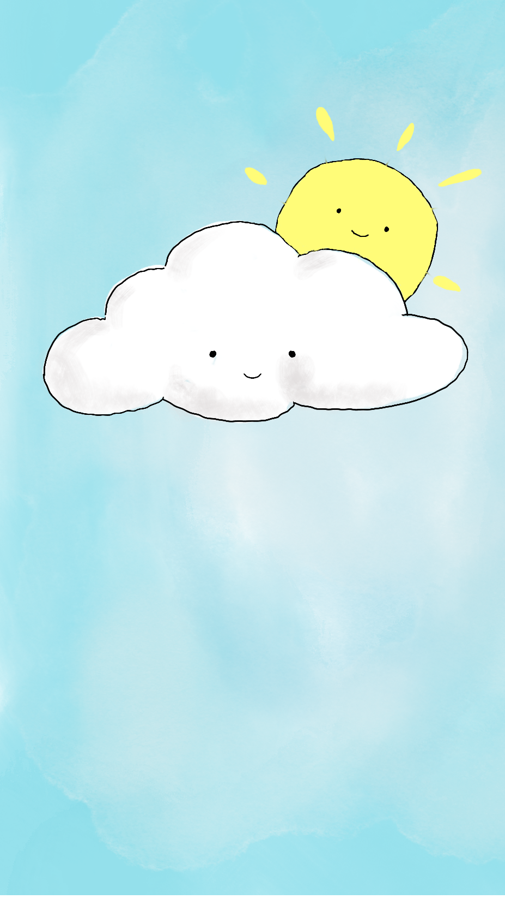

# sunny ☀️

A hand-drawn iOS weather app that reminds you to wear sunscreen on hot days.

**[View Documentation](https://nosey-dewdrop.github.io/sunny/)**



## Features

- Real-time weather based on your location using WeatherAPI
- Hand-drawn Procreate illustrations that change with the weather (8 conditions)
- Sunscreen reminder notifications when temperature exceeds your threshold
- Recurring 2-hour reminders throughout the day (08:00–20:00)
- Doodle-style typography (Patrick Hand font)
- Staggered entrance animations and crossfade transitions
- Reverse geocoding to display your city name
- Baby blue settings screen with adjustable threshold

## Setup

1. Clone the repo
2. Get a free API key from [weatherapi.com](https://www.weatherapi.com)
3. Create `sunny/Config/Secrets.swift`:
   ```swift
   enum Secrets {
       static let weatherAPIKey = "YOUR_API_KEY"
   }
   ```
4. Open `sunny.xcodeproj` in Xcode and run

> `Secrets.swift` is gitignored — never commit your API key.

## Tech Stack

- SwiftUI
- CoreLocation
- UserNotifications
- WeatherAPI
- Patrick Hand (Google Fonts)
- Procreate (illustrations)

## Why

I'm a cancer survivor. Sunscreen isn't optional for me. Every weather app tells you the temperature — none of them remind you to protect your skin. So I built one that does.

## License

MIT
